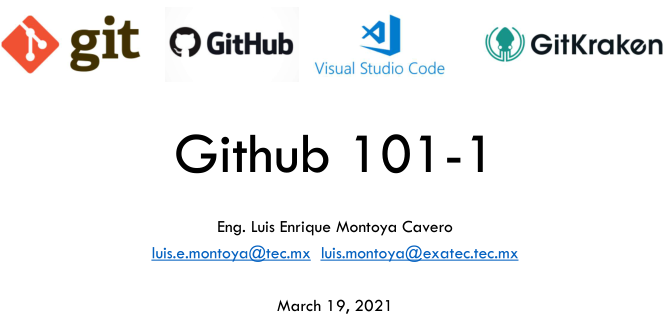
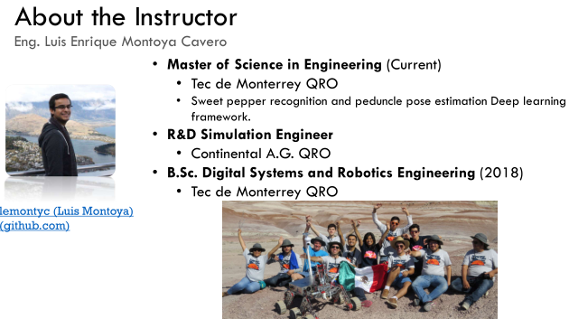

<html>
<head>
<title>ASPIRE</title>
</head>
<body>
  
<h1>Where everyone can find an academic environment to grow.</h1>

<h3> Taller de Github </h3>

Los días 19 y 27 de Marzo y 9 de Abril se llevó a cabo el Taller de Github.

 

<h3> QUANTUM HackMx </h3>

 
[Registrate!](http://hackmx.mx/)

<h3> CENTROS DE VACUNACION EN HERMOSILLO, SONORA </h3>

<noscript></noscript><object class='tableauViz'  style='display:none;'><param name='host_url' value='https%3A%2F%2Fpublic.tableau.com%2F' /> <param name='embed_code_version' value='3' /> <param name='site_root' value='' /><param name='name' value='CentrosdevacunacinenHermosillo&#47;Dashboard1' /><param name='tabs' value='no' /><param name='toolbar' value='no' /><param name='static_image' value='https:&#47;&#47;public.tableau.com&#47;static&#47;images&#47;Ce&#47;CentrosdevacunacinenHermosillo&#47;Dashboard1&#47;1.png' /> <param name='animate_transition' value='yes' /><param name='display_static_image' value='yes' /><param name='display_spinner' value='yes' /><param name='display_overlay' value='yes' /><param name='display_count' value='yes' /><param name='language' value='en' /></object>
                

</body>
</html>
